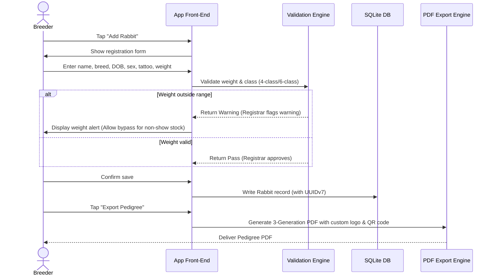
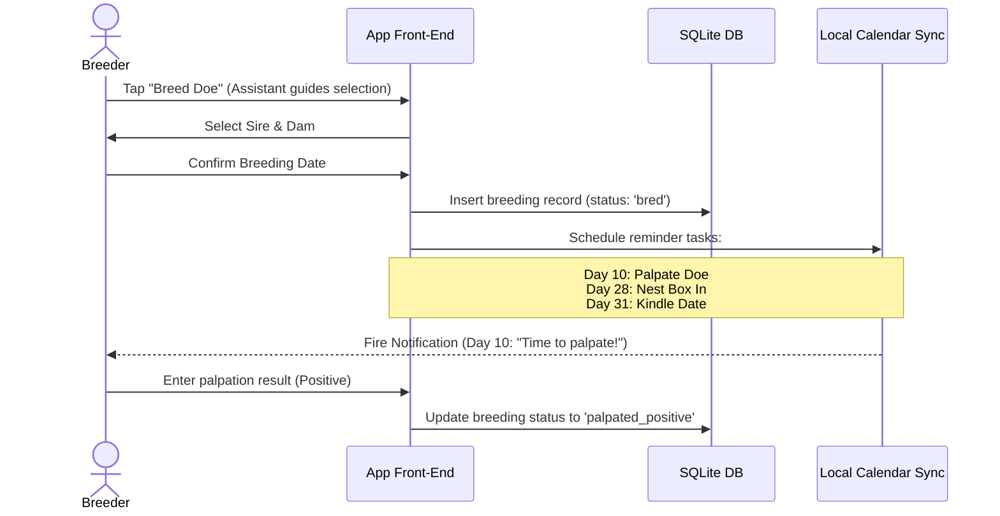

# RabbitryPedigree Pro - Comprehensive Product Specification

Welcome to the official design and architectural specification for **RabbitryPedigree Pro**, the premier offline-first mobile and desktop application designed for serious rabbit breeders, ARBA registrars, and youth program exhibitors.

---

## 1. Vision & Core Value Proposition

RabbitryPedigree Pro is built for real-world barn and farm environments. Spotty cellular coverage, dusty conditions, and fast-paced show days require an application that is **offline-first**, **highly performant**, and **computationally reliable**. By combining strict ARBA Standard of Perfection compliance, genetic calculations, robust privacy safeguards, and a colorful, friendly interface, the application serves as the definitive tool to eliminate registration headaches and improve breeding outcomes.

### User Personas
* **ARBA Registrars & Judges**: Require exact breed standard compliance, pedigree validation, and automated registration prep (ARBA Form 1 generation).
* **Show & Fancy Breeders**: Focus on show legs, Grand Champion titles, pedigree purity, and optimal variety breeding.
* **Commercial & Meat Producers**: Focus on growth rates, litter size, weaning rates, feed conversion ratios, and meat yield metrics.
* **Youth & Hobbyist Exhibitors (4-H / FFA)**: Require parental controls, intuitive guides, and engaging gamified dashboards to track their showmanship projects.

---

## 2. Federal, State, & HIPAA Privacy Compliance

To guarantee absolute compliance with federal guidelines (HIPAA, COPPA, GDPR, CCPA):
1. **HIPAA Safe Harbor & Exclusions**:
   - The application does not collect human medical history, health insurance details, or diagnostic information.
   - Text inputs in veterinary records are automatically sanitized using regex filters to strip terms matching human health markers or medical codes (e.g. human diagnostic codes, human drugs not approved for veterinary use).
   - A clear **HIPAA Disclaimer** must be signed during onboarding: *"RabbitryPedigree Pro is for rabbitry management and veterinary records only. Storing human medical data or personal health records is strictly prohibited."*
2. **COPPA Compliance (Children's Online Privacy Protection Act)**:
   - Youth/4-H accounts are registered under a "Parental Guardian" dashboard.
   - Direct sales, buyer messaging, or public sharing from youth accounts are routed through the parent's contact info.
   - Publicly shared pedigrees generated by youth accounts omit all physical location, email, and phone numbers of the youth.
3. **GDPR/CCPA "Right to Be Forgotten"**:
   - Complete account erasure deletes human profile data, but preserves rabbit pedigree history under a generic "Unknown Breeder" or "Archived Rabbitry" placeholder to avoid breaking the genetic lineages of other active breeders who purchased stock from the user.

---

## 3. Product Modules

### 3.1 Breeding & Reproduction Module
* **Gestation Chain Timeline**:
  - **Day 0: Breeding**: User logs buck, doe, and date.
  - **Day 10-14: Palpation**: Automated reminder to check for pregnancy. Log result (Positive/Negative). If negative, automatically reschedule breeding.
  - **Day 28: Nest Box**: Reminder to place nest box in the doe's cage.
  - **Day 31: Kindling (Gestation Period: 31 days average)**: Alert for predicted kindling. User enters kit count (Alive/Dead).
  - **Day 21: Nest Box Removal**: Reminder to clean out nest boxes.
  - **Day 28-35: Weaning**: Alert to separate kits from dam, log weaning count, and record kit weights.
* **Missed Breeding Analysis**: Logs failed breeding attempts to identify buck/doe fertility issues.

### 3.2 Health & Care Module
* **Individual Medical Records**: Tracks vaccinations (e.g., RHDV2), deworming cycles, illnesses, and injuries.
* **Weight Growth Tracking**: Allows quick logging of individual weights at weaning, 8 weeks, 12 weeks, and maturity. Visualizes growth rate curves to highlight top-performing bloodlines.
* **Sanitization Filter**: Checks health log notes to ensure no human health data is stored, preserving HIPAA bounds.

### 3.3 Inventory & Housing Module
* **Cage Management**: Custom barn mapping. Cages are identified by row, hutch number, and tier.
* **Cage Card Printing**: Generates print-ready cage cards with basic details (tattoo, name, breed, variety, DOB) and a QR code.
* **QR Scanning**: Scanning a hutch QR code instantly pulls up the rabbit's profile page on the mobile app.

### 3.4 Sales & Ledger Module
* **Ledger**: Track feed costs, medical supplies, show entries, and rabbit sales.
* **Buyer Portal & Transfers**: Generate a digital Bill of Sale, contract, and a link/QR code for the buyer to import the rabbit's pedigree directly into their own database.

---

## 4. ARBA Rules & Validation Engine

### 4.1 Show Classes (4-Class vs 6-Class)
The system checks the rabbit's breed standards and automatically calculates its show class:
* **4-Class Breeds**: (e.g., Holland Lop, Mini Rex, Netherland Dwarf)
  - **Junior Buck / Doe**: Age < 6 months.
  - **Senior Buck / Doe**: Age >= 6 months.
* **6-Class Breeds**: (e.g., Flemish Giant, New Zealand, Californian, Champagne d'Argent)
  - **Junior Buck / Doe**: Age < 6 months.
  - **Intermediate Buck / Doe**: Age >= 6 months AND Age < 8 months.
  - **Senior Buck / Doe**: Age >= 8 months.

### 4.2 Breed Weight Validation Matrix
Rabbits must fall within specific weight ranges to be registered and exhibited:
* Weights are entered in ounces (1 lb = 16 oz).
* The rules engine compares the rabbit's current weight, sex, and age category against the target breed minimums and maximums.
* **Example validations**:
  - *Netherland Dwarf Senior Buck*: Minimum weight 2.0 lbs (32 oz), Maximum weight 2.5 lbs (40 oz).
  - *Flemish Giant Senior Doe*: Minimum weight 14.0 lbs (224 oz), No maximum weight.

---

## 5. UI/UX Mascot & Scene Design Guide

The interface is designed to be vibrant, intuitive, and fun, incorporating custom colorful mascot companions and scene aesthetics that are playful and modern (not anime).

### Mascot Character Specifications
* **Barn Registrar (The Registrar Representative)**:
  - *Appearance*: A stylized, friendly White New Zealand rabbit mascot, wearing a miniature registrar collar or badge.
  - *Locations*: Verification screens, registration forms, onboarding welcome card.
  - *Behaviors*:
    - Enjoys compliant weights (displays a sparkly *SOP Passed* badge).
    - Holds up a warning sign for out-of-spec weights.
* **Barn Assistant (The Field Assistant)**:
  - *Appearance*: A stylized, friendly broken-pattern Holland Lop rabbit with floppy ears.
  - *Locations*: Calendar, breeding dashboard, nest-box reminders.
  - *Behaviors*:
    - Points at checklists, prompts gestation milestones, and celebrates successful litter logs.
* **Genetics Sage (The Genetics Wizard)**:
  - *Appearance*: A stylized, friendly blue-gray Netherland Dwarf rabbit with glasses.
  - *Locations*: Pedigree tree builder, inbreeding coefficient screens.
  - *Behaviors*:
    - Shows Wright's coefficient metrics.
    - Displays genetic summaries in clear, helpful dialog bubbles.

### Dynamic Theme Specifications
1. **Kawaii Clover Garden (Pastel Pink/Mint)**:
   - Soft background colors to soothe the eyes during late-night barn checks.
   - Floating clover leaf particles that respond to device tilt.
2. **Neon Cyber-Barn (Cyberpunk Purple/Cyan)**:
   - High-contrast neon borders perfect for dark barns or direct-sunlight show tables.
   - Cybernetic grids and retro pixel art bunny guides.
3. **Ghibli-esque Orchard (Watercolor Warmth)**:
   - Warm wood-grain cards, soft leaf fall animations, and hand-painted texture palettes.

---

## 6. Detailed User Flows

### Flow 1: Registering a Rabbit & Printing Pedigree

### Flow 2: Breeding & Gestation Logging

---

## 7. Offline-First Synchronization & Architecture

### System Synchronization Protocol
* **UUIDv7 Primary Keys**: All records use UUIDv7 keys. This embeds millisecond timestamps within the identifier, allowing local creation of records offline while guaranteeing conflict-free sequencing upon merging with the cloud database.
* **Sync Log Queue**: Every write operation (Insert, Update, Delete) is appended to a local `sync_queue` table with schema:
  `id UUID, table_name VARCHAR, action VARCHAR, payload JSONB, created_at TIMESTAMP`.
* **Conflict Resolution**:
  - *Insert conflicts*: Handled via UUIDv7 uniqueness.
  - *Update conflicts*: Last-Write-Wins (LWW) based on the UUIDv7 timestamp.
  - *Pedigree relationship conflicts*: If two family trees conflict, the record is flagged for the user to select the correct sire/dam path.
* **Data Reduction**: Sync payload compression is executed using binary-packed JSON (MessagePack) to minimize cellular roaming costs.
